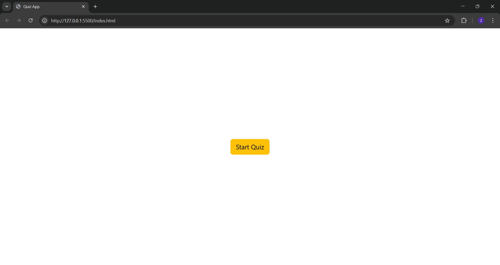
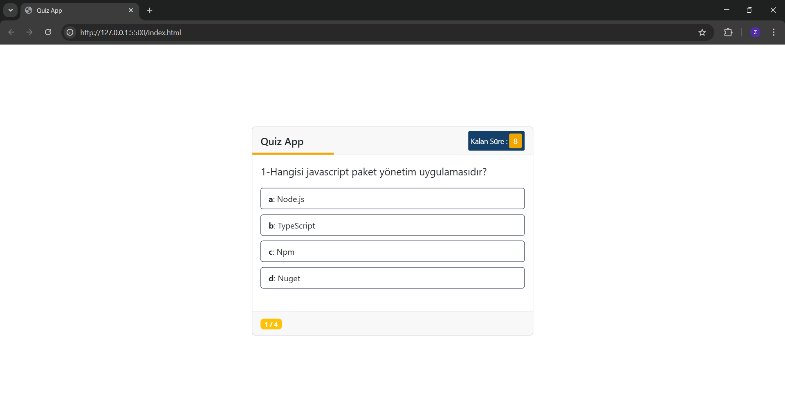
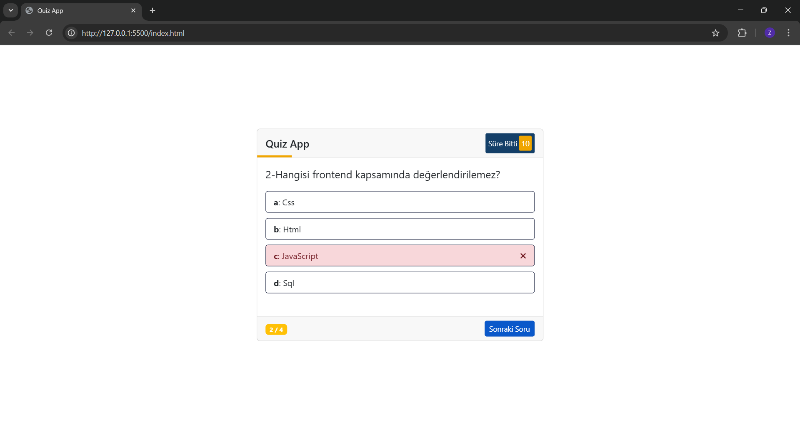
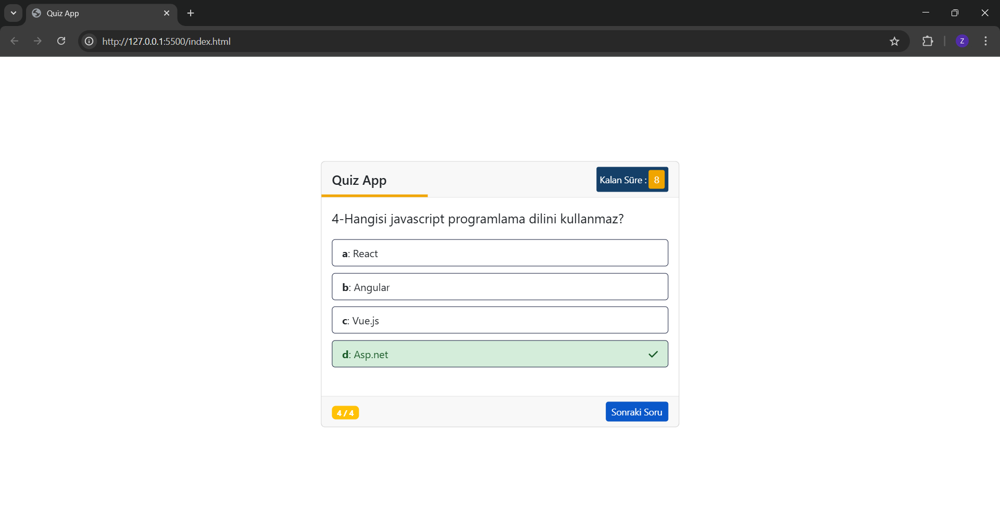
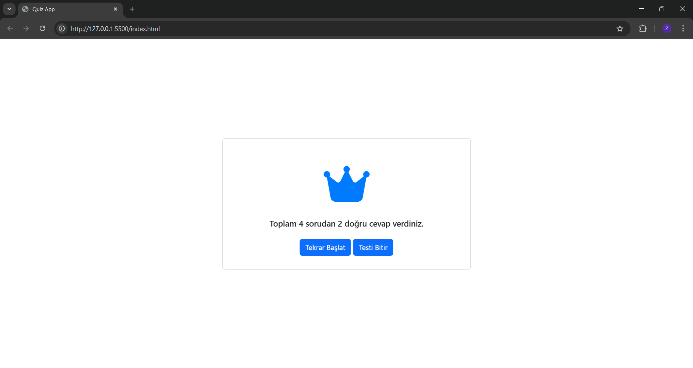

# Quiz App

Kullanıcıların bilgi seviyelerini test edebilecekleri, sorulara yanıt verebilecekleri ve sonuçlarını görebilecekleri basit bir **Quiz Uygulaması**.

## Proje Konusu

Bu proje, kullanıcıların farklı konularda bilgi seviyelerini ölçebilecekleri ve eğlenceli bir şekilde öğrenebilecekleri **Quiz Uygulamasıdır**. Kullanıcılar soruları yanıtlayabilir, zamanlayıcı ile süreyi takip edebilir ve sonuçlarını görebilirler.

## Neden Geliştirildi, Motivasyon

Bu uygulamayı geliştirme motivasyonum : **web geliştirme becerilerimi ilerletmek ve JavaScript'te daha fazla deneyim kazanmak** istedim.

## Ne Öğrendim?

Bu projeyi geliştirirken aşağıdaki konularda bilgi ve deneyim kazandım:

- **HTML, CSS, JavaScript** kullanarak interaktif bir web uygulaması geliştirme.
- **DOM manipülasyonu** ile sayfadaki bileşenleri dinamik olarak güncelleme.
- **Event Listener'lar** ile kullanıcı etkileşimlerini yönetme.
- **Zamanlayıcı (setInterval, setTimeout)** kullanımıyla geri sayım ve ilerleme çubuğu yönetimi.
- **Bootstrap** ile responsive tasarım oluşturma.

## Ekran Görüntüleri

  
  
  
  
  
  
  
  
  
